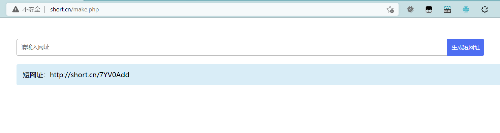

# short-url

短网址生成，纯PHP实现，代码仅11.9 KB，版本要求：PHP >= 5.4



## 功能列表
* 生成短网址、短网址跳转
* 使用随机序列，让生成的短码没有规律
* 启用权限验证，用于内部生成短网址
* 启用禁用ip功能，防止暴力破解（访问错误的短码后会记录）
* 可使用接口生成短网址（make.php）

## 部署步骤

1. 下载项目
```bash
git clone https://github.com/zhanguangcheng/short-url.git
```

1. 配置域名到项目的web目录，如`http://short.cn`
2. 生成随机序列  
浏览器访问`http://short.cn/make-random.php`，将结果分别替换掉`components/ShortUrlHelper::$baseList`属性值和`short-url.sql`中的自增编号（AUTO_INCREMENT=2000000000）
3. 导入数据库：`short-url.sql`
4. 配置数据库和域名：`config.php`

## 使用方法
1. 生成短网址
```
http://short.cn
```
2. 短网址跳转
```
http://short.cn/xxxxxx
```

减短网址的技巧：
1. 优先选择较短的域名
2. 开启Apache或nginx的重写，最终的格式：`http://short.cn/xxxxxxx`